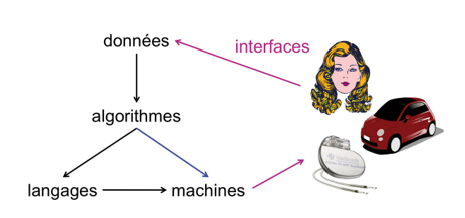

# Les Sciences numériques et technologiques
## Informatique 
*l’informatique calcule sur l’information à l’aide d’algorithmes, de programmes et de machines, essentiellement des ordinateurs de toutes sortes. L’information est codée dans des données numériques, l’algorithme est le mécanisme conceptuel de calcul systématique, le programme constitue l’écriture précise de l’algorithme dans des langages appropriés, et la machine est l’objet matériel capable de faire les calculs nécessaires pour transformer les programmes en actions. Un point essentiel est que la nature physique des objets matériels qui servent à stocker les données et faire les calculs est indifférente : la même information peut être stockée sur n’importe quel support, et n’importe quel ordinateur peut faire les mêmes calculs que n’importe quel autre.*
*l’informatique est la même partout. Pour elle, il n’y a pas de différence fondamentale entre un système de gestion bancaire, un appareil photo numérique, une expérience de physique, un dispositif médical ou un réseau social.*

Malgré leur grande variété (les activités liées au developpement des sciences de l'informatique, diverses, mais convergentes grâce au numérique), ces avancées se fondent toutes sur l’universalité et la flexibilité d’un petit nombre de concepts en interaction :

L'informatique, c'est une discipline nouvelle pour les élèves, avec un schéma de pensée à construire.

* Les données sont l’objet de travail de l’informatique
* algorithmes : ce sont des processus de calcul automatisables,
* langages : Les langages servent à décrire les fonctions à réaliser et les algorithmes pour les réaliser.
* machines, reseaux, et circuits électroniques
* À ces concepts s’ajoute un élément transversal: les interfaces qui permettent la communication avec les humains, la collecte des données et la commande des systèmes.

Berry, Gérard. L' Hyperpuissance de l'informatique: Algorithmes, données, machines, réseaux (OJ.SCIENCES) (French Edition) . Odile Jacob.

# Contenu du programme 
*s’inscrit dans le prolongement de l’enseignement d’algorithmique, d’informatique et de programmation dispensé au collège en mathématiques et en technologie.*
## Objectif principal de SNT 
permettre d’appréhender les principaux concepts des sciences numériques. Comprendre le poids croissant du numérique et les enjeux qui en découlent.
## Objectif secondaire
L’enseignement de sciences numériques et technologie aide à mieux comprendre les enjeux scientifiques et sociétaux de la science informatique et de ses applications, à adopter un usage réfléchi et raisonné des technologies numériques dans la vie quotidienne et à se préparer aux mutations présentes et à venir de tous les métiers.

## Les 7 thematiques du programme : 

* Internet
* Le Web
* Les reseaux sociaux
* Les données structurées et leur traitement
* Localisation, cartographie et mobilité
* Informatique embarquée et objets connectés
* La photographie numérique